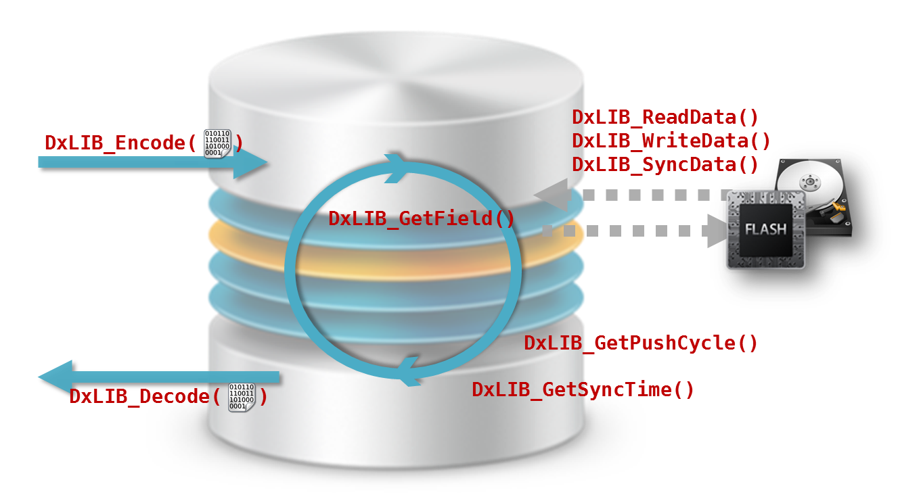

DaMa
====

## DB 구조


#### Main DB
> Ram에 상주 하는 DB
> Flash 및 HDD에 저장되어 있는 File DB를 Load하여 구성되는 Superset

#### File DB
> Flash 및 HDD에 저장되는 목적의 DB

#### Binary File
> DB 사이즈를 줄이기 위해 큰 사이즈의 데이터들을 따로 파일로 저장
> Binary 파일들에 대한 링크만 DB에 저장됨

## 동작

`빨간 글씨들은 dlib과의 관계`
### Set
```c
/**
 * Batch begin/end 사이에 DAPI_Set을 호출하면 한번에 모았다가 Set을 함
 * 빨라빨라빨라~
 */
DERROR	DAPI_BatchBegin (const HCHAR *name);
DERROR	DAPI_BatchEnd (const HCHAR *name);

/**
 * data를 dama에 전송
 */
DERROR	DAPI_Set (const HCHAR *name, HUID uid, const void *data, HUINT32 size);
```
> DaMa로 데이터를 전송
* DxLIB_Encode
	* 전송 받은 데이터를 저장용 포멧으로 Encoding(ex. json)
* DxLIB_GetField
	* DB Field를 참조하여 인덱싱
* DxLIB_WriteData
	* 만약 데이터 사이즈가 커서 (ex. IP-EPG) 외부 저장소를 사용해야 하면, 사용
* 데이터에 변화가 감지되면, notification Q에 등록

### Reset
```c
/**
 * name과 uid에 match되는 데이터를 삭제
 */
DERROR	DAPI_Reset (const HCHAR *name, HUID uid);

/**
 * name에 match되는 테이블을 삭제
 */
DERROR	DAPI_ResetTable (const HCHAR *name);

/**
 * 모든 DB Table을 삭제 & Sync
 * 이 함수는 동기화를 보장함
 */
DERROR	DAPI_ResetAll(void);
```
> 데이터 삭제
* reset item (by UID)
	* main db에서 item DELETE
		* 만약 외부 저장소를 사용하면, 삭제 (DxLIB_WriteData(0))
	* notification Q에 등록
* reset table
	* main db에서 table 삭제
	* notification Q에 등록 
* reset all
	* DB 전체 삭제 (저장된 파일 포함)

### Request
```c
/**
 * name 과 uid에 match되는 데이터를 dama로부터 get
 * - getter는 async로 호출 됨
 */
DERROR	DAPI_Get (const HCHAR *name, HUID uid, DAPI_Getter getter, void *userdata);

/**
 * query에 match되는 데이터를 dama로 부터 get
 */
DERROR	DAPI_Query (const HCHAR *query, DAPI_Getter getter, void *userdata);

/**
 * name 에 match 되는 모든 테이블의 데이터를 dama로부터 get
 */
DERROR	DAPI_GetAll (const HCHAR *name, DAPI_Getter getter, void *userdata);
```
> 데이터 검색
* uid, table name, 또는 full SQL로 데이터 검색
* DxLIB_Decode
	* 저장된 데이터를 기존 데이터 형태로 Decoding (ex. json to structure)
* 만약 외부 저장소를 사용하는 경우 DxLIB_ReadData를 통해 데이터 Load

### Notification
```c
/**
 * name과 uid에 match되는 데이터의 업데이트가 있는 경우, notifier가 오도록 등록
 * - notifier는 async로 호출됨
 */
HUINT32	DAPI_AddNotifier (const HCHAR *name, HUID uid, DAPI_Getter notifier, void *userdata);

/**
 * name에 match되는 데이터의 업데이트가 있는 경우, notifier가 오도록 등록
 * - notifier는 async로 호출됨
 */
HUINT32	DAPI_AddTableNotifier(const HCHAR *name, DAPI_Getter notifier, void *userdata);

/**
 * notifier 등록 해제
 */
void	DAPI_RemoveNotifier (HUINT32 id);
```
> 데이터의 변화 감지
* DaMa 내부적으로 일정 시간에 한번 씩, Push Notification Q 검사
* Notification 정책
	* DxLIB_GetPushCycle()가 포팅된 경우,
		* 명시된 cycle 내의 notification을 push
	* DxLIB_GetPushCycle()가 포팅되지 않은 경우,
		* 1초 이내에 notification Q의 변화가 없는 경우 push (이는 빈번한 push를 회피 하여, 성능 개선에 도움을 줌)

### Sync
```c
/**
 * name 에 match되는 DB table을 storage에 sync
 */
DERROR	DAPI_Sync (const HCHAR *name);

/**
 * 기능은 DAPI_Sync와 같지만, term (millisec) 동안 name에 대한 아무런 API call이 없는 경우
 * 동기화를 시도한다.
 * - 자잘하게 요청이 많은 경우 성능 유지를 할 수 있다.
 */
DERROR	DAPI_LazySync (const HCHAR *name, HUINT32 term);
```
> 데이터를 저장소에 저장
* Sync 정책
	* DxLIB_GetSyncTime()이 포팅된 경우,
		* 명시된 time 에 한번씩 `DB에 변화가 있는 경우` 저장
	* DxLIB_GetSyncTime()이 포팅되지 않은 경우,
		* 위의 함수를 호출하여 강제 싱크를 하지 않으면 싱크되지 않음

### Restore
```c
/**
 * name 에 match되는 DB table을 storage로부터 load
 */
DERROR	DAPI_Restore (const HCHAR *name);
```
> 메인 DB의 데이터를 삭제 하고, 파일로 부터 데이터 강제 복구
